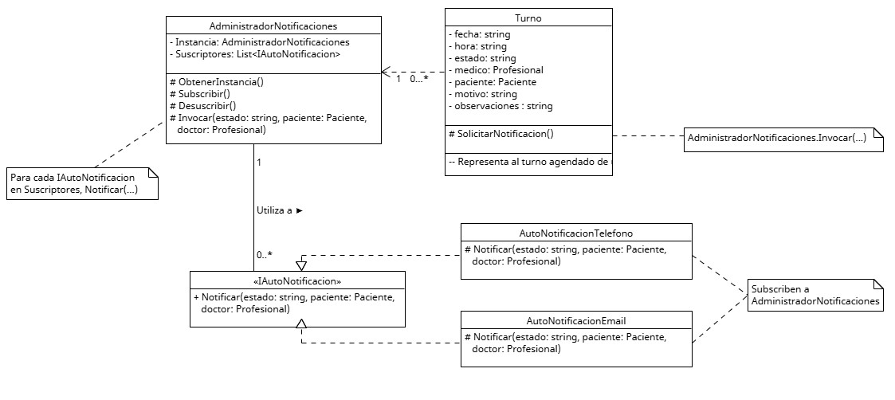

# Anexo - Aplicación de Patrón de Diseño creacional - Singleton
Los patrones de diseño creacional se centran en el proceso de creación de objetos y buscan que un sistema logre una mayor independencia sobre cómo se crean, componen y representan sus objetos.

La relacion con los principios SOLID viene de que ya que se busca
mejorar la calidad del codigo proponiendo por ejemplo decidir el encargado de la creacion de los elementos o generar variaciones de objetos sin afectar su funcionamiento, lo que respeta a los principios.

Propósito y Tipo del Patrón: En el sistema de la clinica se presentaba el problema de que podian existir varias instancias de los notificadores, siendo asignadas a cada turno que quisiera notificar algun cambio en su estado. 
Esto seria un uso innecesario de los recursos del sistema, por este inconveniente es que se decidio aplicar el patron Singleton, que asegura una sola instancia
encargada de enviar las notificaciones necesarias.

## Motivación
En el sistema pensado para la clinica, los turnos son quienes estan encargados de llamar a la funcion Notificar()
dentro de la interfaz << IAutoNotificacion >>, que es implementada por las diferentes clases notificadoras.
Esto significa que no solo es necesario generar y almacenar una instancia de un sistema notificador para cada elemento
sino que tambien es mas completo hacer un control de los mensajes enviados.
Teniendo en cuenta lo inconveniente de este diseño inicial y teniendo tambien en cuenta la implementacion del patron Observer,
se pudo modificar el funcionamiento para que la clase AdministradorNotificaciones (nuevo intermediario entre << IAutoNotificacion >> y Turno)
se convierta en un Singleton que asegure la existencia de una unica instancia global de si mismo, asi cualquier turno tendria acceso
al sistema de turnos al llamar al metodo Invocar(...) que da aviso a las diferentes implementacions (AutoNotificacionTelefono, AutoNotificacionEmail)
para que envien los avisos correspondie 

## [Estructura de Clases](https://drive.google.com/file/d/1sN_XM9FRif1y0mlLrJBKkoF6hUz4Mvz7/view?usp=drive_link)

