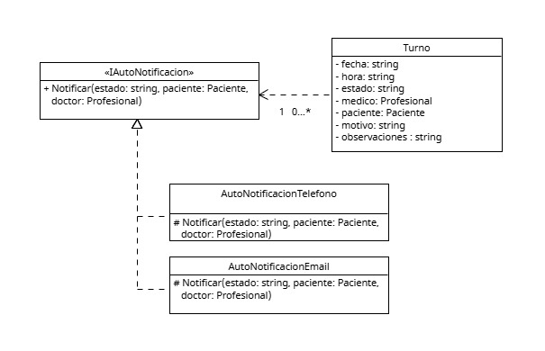

# Anexo - Aplicación de Patrón de Diseño creacional - Command
Los patrones de diseño creacionales, similar a los principios SOLID, son guias o diseños sugeridos que estan encargados de ayudar a solucionar problemas comunes, logrando una comunicación mas efectiva y la correcta asignación de responsabilidades entre objetos.
Tambien, estos patrones se basan o integran los principios SOLID dentro de su propia propuesta. En este caso elegido, el patron Command resuena mucho con el principio SOLID de Sustitución de Liskov. 
Por lo anteriormente mencionado, ayudan en gran manera a definir cómo los objetos interactúan y colaboran para lograr un objetivo, buscando que el codigo resultante sema mas flexible, mas facil de reutilizar y mas comodos de darle mantenimiento durante su uso.

Propósito y Tipo del Patrón: En el caso de la clinica, existe la necesidad de avisar de cualquier cambio que pueda tener un turno tanto al doctor que provee la atencion, como al paciente dueño del turno.
Esto se debe hacer por varios medios segun su disponibilidad, teniendo un telefono se deberia avisar por mensaje de texto o whatsapp y teniendo correo tambien se puede enviar un correo electronico.
Estos comportamientos similares se ven beneficiados por el patron command, teniendo una interfaz que contiene la accion de notificar, se puede comenzar el aviso correspondiente entre los diferentes metodos. pudiendo asi, por ejemplo, avisar por mensaje a un paciente que no tiene un correo electronico.

## Motivación
El sistema, al dar uso a varios metodos posibles de comunicacion, necesita de una forma util
En este caso, se resolvio aplicar el patron creacional llamado Command a travez de la abstraccion de la interfaz de notificacion de sus implementaciones especificas.
Utilizando una interfaz << IAutoNotificacion >> que contiene un metodo abstracto denominado Notificar(), se implementan varias clases mas especificas que estan encargadas de llevar a cabo el aviso por los diferentes medios de comunacion como AutoNotificacionTelefono, AutoNotificacionEmail, etc.
Asi, el turno puede tener asignado el/los notificador/es que sean necesarios o preferidos por quien va a recibir el aviso.
Esto remplaza la implementacion inicial de una clase abstracta AutoNotificacion representada por sus diferentes hijos mas especificos al medio de contacto.

## [Estructura de Clases](https://drive.google.com/file/d/1pQlvvfBmvJlyxoWgg_oADafrtOOZFpmu/view?usp=drive_link)

