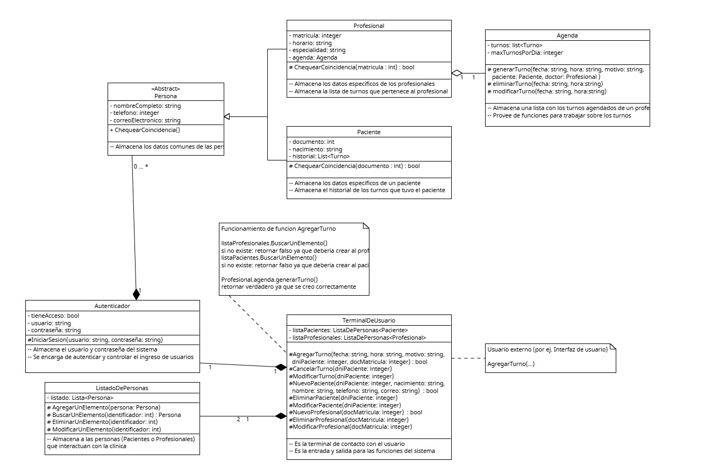

# Anexo - Aplicación de Patrón de Diseño Estructural - Facade
Los patrones estructurales explican cómo ensamblar objetos y clases en estructuras más grandes, realizando las relaciones entre las partes a la misma vez que se mantiene la flexibilidad y eficiencia que ya tenian por separado

Una breve explicación de que son los patrones de diseño creacionales, y cómo se
relacionan con los principios SOLID.
Propósito y Tipo del Patrón: Una breve explicación del problema y cómo el patrón
seleccionado lo soluciona.

## Motivación
En el sistema de la clinica, gran parte de las acciones se dividen entre los actores representados, es asi que la clase Turno avisa de cambios de estado, la clase agenda lee y modifica los turnos agendados, etc.
Esto es muy util a la hora de administrar un buen diseño del sistema, pero a la hora de utilizarlos se vuelve incomodamente complejo.

Tomando como ejemplo el generar un turno: se deberia llamar a la funcion ListadoDePersonas.AgregarUnElemento(...) para encontrar el cliente y profesional necesarios, si no existen se debe llamar a ListadoDePersonas.AgregarUnElemento(...) primero, acto seguido se usa la agenda del profesional Agenda.GenerarTurno(...) para crear el turno y asi se continua 

Es asi que teniendo la fachada de TerminalDeUsuario se puede simplificar el funcionamiento para los usuarios. La solucion propuesta, segun propone el diseño Facade, es tomar esta logica necesaria y encapsularla en la clase TerminalDeUsuario, con funciones expuestas a los usuarios que haga todo el trabajo necesario con una simple funcion

Con el mismo ejemplo anterior, simplemente se llamaria a la funcion TerminalDeUsuario.AgregarUnTurno(...) con los parametros necesarios y ya se genera el turno deseado

## [Estructura de Clases](https://drive.google.com/file/d/1uiO7YfESFE95hZj8Ed1pAvkNj402wjpr/view?usp=drive_link)

