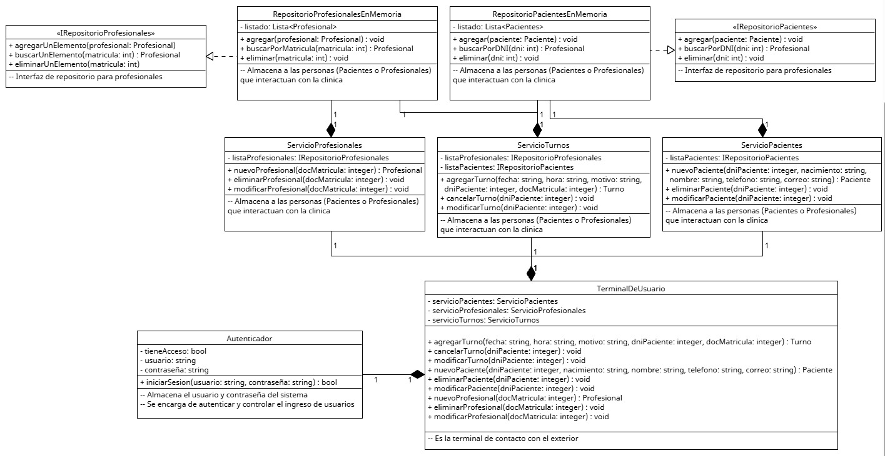

# Anexo - Aplicación de Patrón de Diseño Estructural - Facade
Los patrones estructurales explican cómo ensamblar objetos y clases en estructuras más grandes, realizando las relaciones entre las partes a la misma vez que se mantiene la flexibilidad y eficiencia que ya tenian por separado

En su mayor parte se relacionan con todos los principios SOLID de alguna forma u otra, pero el mas afectado es OCP ya que permiten agregar estructuras o funcionalidades sin modificar lo ya existente e implementar las composiciones con el proposito mantener lo mas posible la aplicacion de los principios.

Propósito y Tipo del Patrón: El problema del sistema de la clinica provenia de su gran disponibilidad de funcionalidades 
que necesitaban de acceso a diferentes partes del sistema, lo que lleva a que se necesiten varios pasos para hacer algunas tareas
Pensando en simplificarlo para el usuario o sistema que quiera interactuar, es que se penso en crear esta clase TerminalDeUsuario 
para englobar y organizar el funcionamiento interno

## Motivación
En el sistema de la clinica, gran parte de las acciones se dividen entre los actores representados, es asi que la clase Turno avisa de cambios de estado, la clase agenda lee y modifica los turnos agendados, etc.
Esto es muy util a la hora de administrar un buen diseño del sistema, pero a la hora de utilizarlos se vuelve incomodamente complejo.

Entonces es que se penso en crear a TerminalDeUsuario como una facade, que englobe estos servicios y se pueda simplificar el funcionamiento para los usuarios/sistemas externos. La solucion propuesta, segun propone el diseño Facade, es tomar las funciones necesarias y organizarlas en la clase TerminalDeUsuario, con funciones expuestas a los usuarios que haga todo el trabajo de coordinacion necesario con una simple llamada a un metodo

Como ejemplo, al agregar un turno simplemente se llamaria a la funcion TerminalDeUsuario.AgregarUnTurno(...) con los parametros necesarios y ya se encarga de que el turno se genere

## [Estructura de Clases](https://drive.google.com/file/d/16zWODuoEetrkoIwMgV98SbJl5ziBYEqx/view?usp=drive_link)

