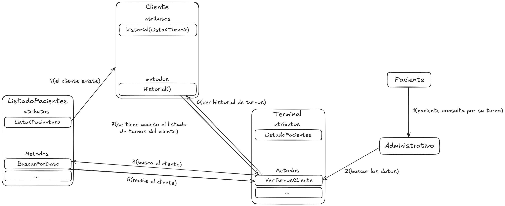
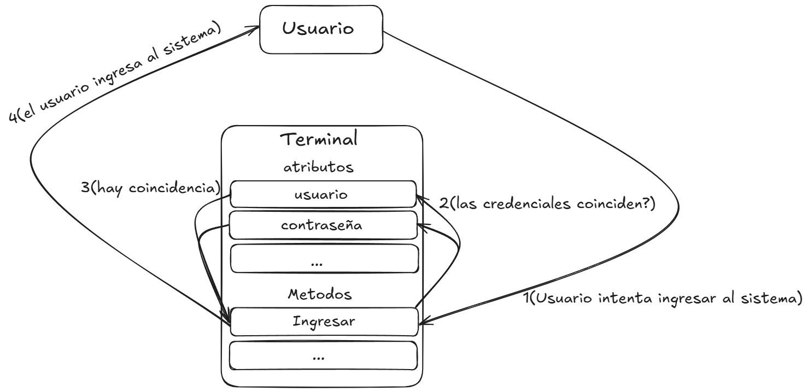
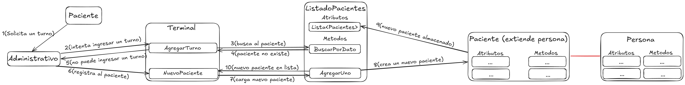
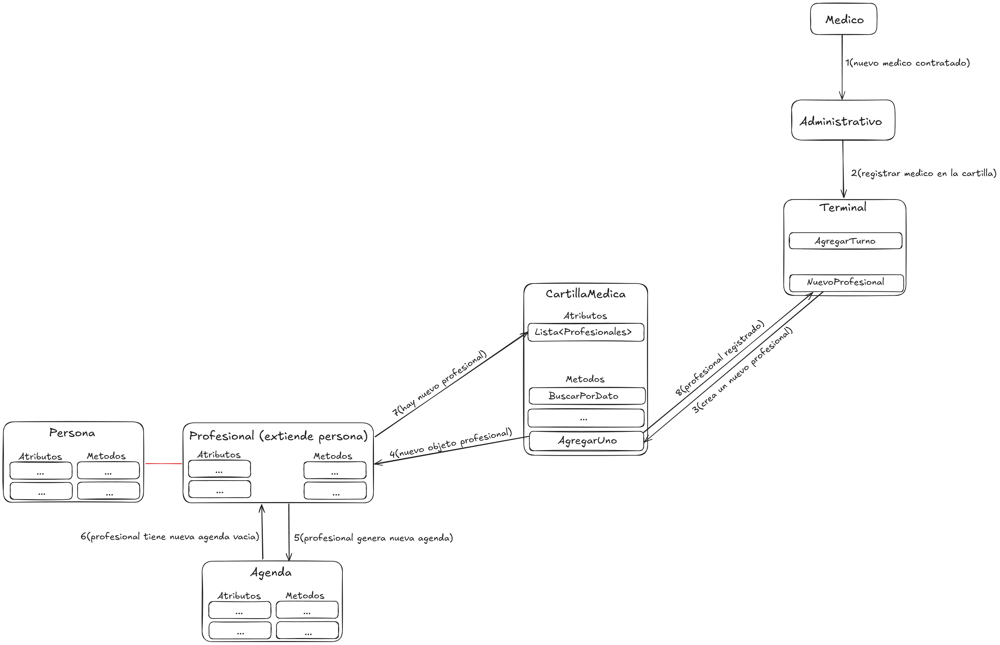
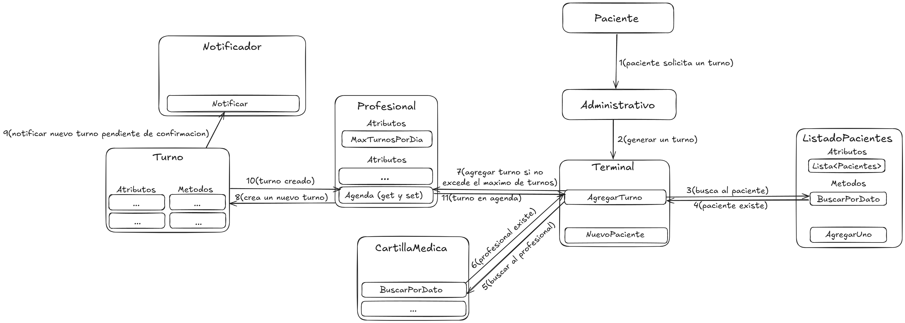

# Casos de Uso

- ## Caso de uso 1 - Consulta de turnos [Link](https://excalidraw.com/#json=AED3yPexNdZczNYoA4dUU,B7vEwTb5u_kQApd8RkXbdA "Title")

- ## Caso de uso 2 - Ingresar al sistema [Link](https://excalidraw.com/#json=MS1PZEayS3eAQnTQpyd2D,q3PaVCcaToZ4PgSncgpJow "Title")

- ## Caso de uso 3 - Registrar paciente [Link](https://excalidraw.com/#json=IqBdM2EZaIa0HUI6knuqQ,eIv8BJ5vcmZ0_2hYLKLxpg "Title")

- ## Caso de uso 4 - Registrar profesional [Link](https://excalidraw.com/#json=WW4-Djcw6H4YxeWt-jiOw,Kqoz0JokRZJpIQGZyAE6wg "Title")

- ## Caso de uso 5 - Solicitar nuevo turno [Link](https://excalidraw.com/#json=N_J3sMQOM0vHXaI2ycD8B,Cs_hHrvysIJYgt-9aicFAw "Title")

