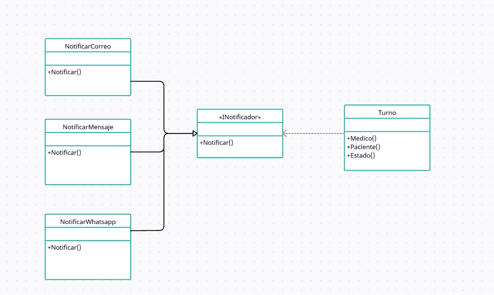

# Principio de Inversión de Dependencias (DIP)

Este principio propone que las clases de un sistema deberian depender no de la implementacion especifica de una clase, sino de una abstraccion o interface.
Evitando asi depender de los detalles de la propia implementacion.

La idea es aislar nuestra clase detras un limite formado por las abstracciones. Asi si llegaran a cambiar los detalles de la implementacion, nuestra clase sigue siendo segura. 
Esto ayuda a mantener un bajo acoplamiento y facilita la modificación de nuestro diseño.

## Motivacion

Un gran problema del sistema de turnos es que este dependia de los sistemas de bajo nivel implementados para dar apoyo a sus funcionalidades, como puede ser el sistema de correo electronico utilizado o los software que entregan su funcionalidad al sistema.

Aplicando este principio se pudo separar al programa de estos sistemas a traves de interfaces que nos permiten abstraernos de estos sistemas, como puede ser una interfaz de almacenamiento que se comunique con el gestor de bases de datos, La interfaz de comunicaniones que nos permite enviar notificaciones a traves de cual sea el medio y proveedor utilizado, etc.

Esto nos permite una gran flexibilidad comercial y fiabilidad sin necesidad de implementar soluciones especificas para cada herramienta utilizada.

Un ejemplo del mundo real seria si en la clinica cada vez que necesita enviar documentacion, se la entregan al fletero que pasa por la oficina, pero el dia que el falte no se podria hacer envios ya que se lo espera a el especificamente. entonces se podria solucionar dejando la documentacion en algun lugar, como un buzon. Asi, cualquier servicio de correo que tenga las mismas funciones/servicios podria llevarse la documentacion para hacer la entrega

## [Estructura de clases](https://drive.google.com/file/d/1zaYJx8ratpRkXbpawFEIE9smDY4H86pp/view?usp=drive_link)

