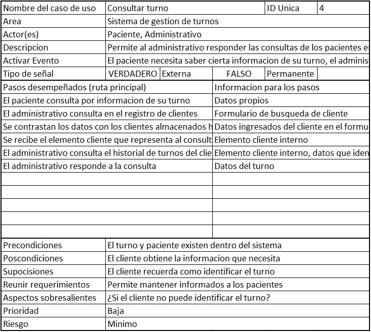
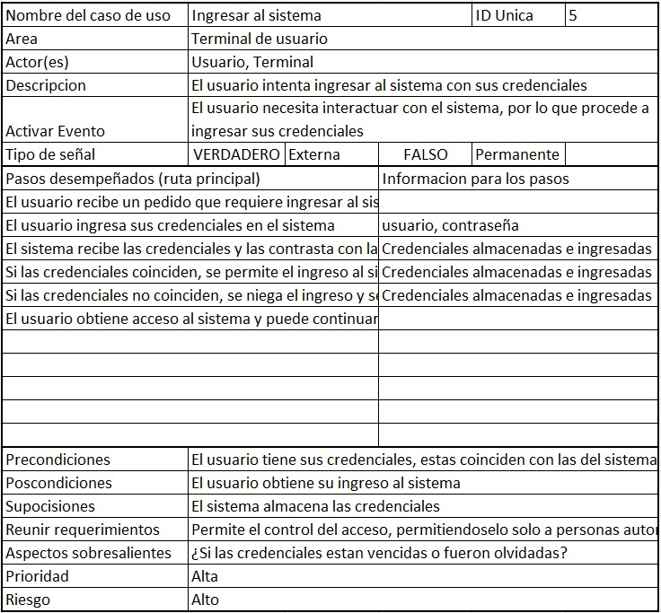
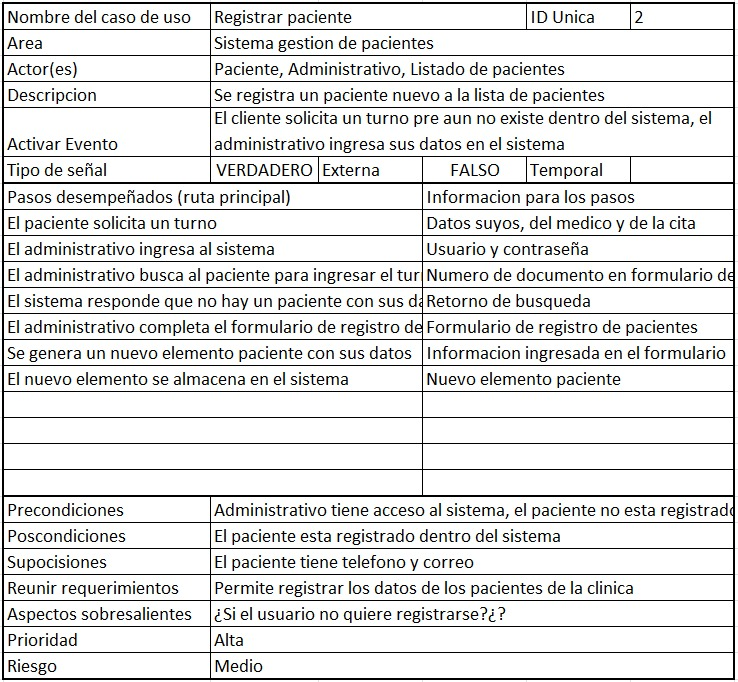
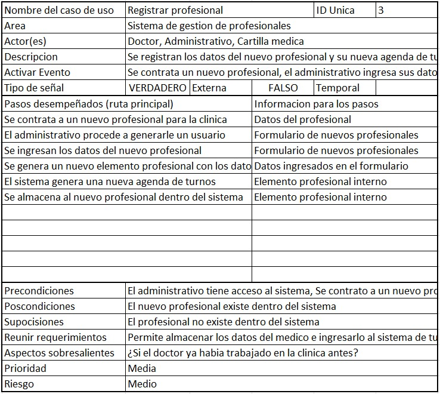
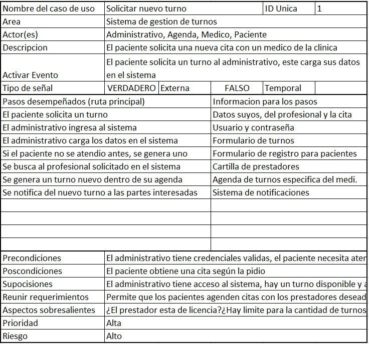

# Escenarios de Casos de Uso

Hoja de calculo: [Link](https://docs.google.com/spreadsheets/d/1TZExWZXH0dbuX0u6H-fMKVTFdfDUWF9VA8hcWk7sAmU/edit?usp=sharing "Title")

- ## Caso de uso 1 - Consulta de turnos  

- ## Caso de uso 2 - Ingresar al sistema

- ## Caso de uso 3 - Registrar paciente

- ## Caso de uso 4 - Registrar profesional

- ## Caso de uso 5 - Solicitar nuevo turno

