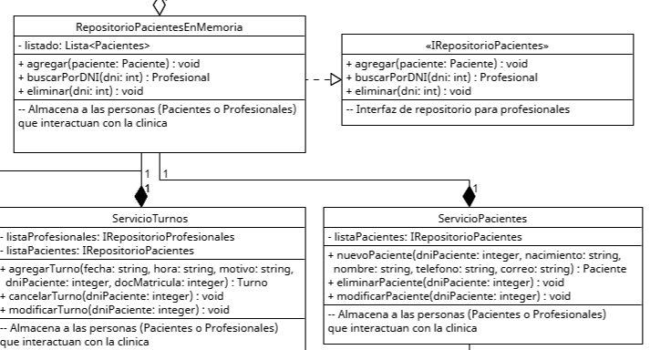

# Abstraccion

La abstraccion se trata de separar el objeto de su implementacion interna. Al generalizar el entendimiento de este y sus acciones, se permite que la interaccion sea a travez de interfaces utiles para el consumidor, sin prestar acceso a informacion innecesaria o poco util.
Se basa en la idea de que al usar un sistema uno no sabe, ni necesita saber, la implementacion interna o que componentes tiene. Solo se necesita saber que es y como interactuar con la interfaz que este sistema nos presenta.
Estas abstracciones ayudan mayormente con el principio de Liskov, ya que una clase puede interactuar con un "Asiento" para sentarse sin preocuparse si es una "Silla" o un "Banquito", y con el principio de Dependency Inversion, ya que al abstraer se pueden generar interfaces que desacoplen las interacciones entre clases

## Ejemplo del proyecto

  
[link a foto en gdrive](https://drive.google.com/file/d/1ANgiuRagmZDWPgiJU0Po8rDd5pviKW7q/view?usp=drive_link)

Este tipo de principio se implementaria en la mayoria de las clases, pero las clases de repositorios son el mejor ejemplo, ya que "esconden" su funcionamiento a travez de una interfaz y el de los componentes que puedan llegar a tener, al solo exponer metodos que describen las acciones posibles y que informacion se necesita, por ej. si se quiere agregar un paciente: agregar( < datos del paciente > )

## Ejemplo de codigo

```csharp

// Esta interface abstrae a los repositorios al definir como funcionan,
// sin importar la implementacion que tengan
interface IRepositorioPacientes {
    public abstract void agregar( /*params*/ );
    public abstract Profesional buscarPorDNI( /*params*/ );
    public abstract void eliminar( /*params*/ );
}

/* ServicioPacientes no sabe como funciona internamente el
repositorio de pacientes, a pesar de consumir esta interfaz correctamente */
class ServicioPacientes(){
    private IRepositorioPacientes repositorioPacientes;
    
    public constructor() {
         /* inicializacion */ 
    }

    // ...
}

```

En este ejemplo, ServicioPacientes hace uso de un repositorio con la informacion de los pacientes.
Al hacerlo a traves de una interfaz, este se abstrae de la implementacion real.
Pudiendo ser por ej. RepositorioPacientesEnMemoria o RepositorioPacientesEnMySQL