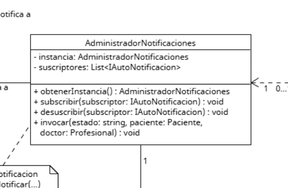

# Encapsulamiento

El encapsulamiento se trata de crear clases y objetos que contengan atributos y comportamientos dentro de si, coherentes con la entidad que representan y administrando de forma propia su acceso y procesamiento. 
Asi se puede organizar el codigo en entidades que funcionen como "capsulas" que contengan su contexto completo.
Por ejemplo, si se cambiara de habitat a un animal, este seguiria siendo el mismo ya que sus caracteristicas dependen de la informacion propia que contiene.
En este caso el mayor principio beneficiado es el de Single Responsibility, ya que para encapsular es necesario asegurarse de que una clase contenga tareas y atributos pertinentes a la entidad, tambien aplicaria el Open/CLosed ya que al encapsular correctamente se evita que en futuros cambios se haga necesario modificar a la clase, facilitando el poder extenderla con nuevas funciones

## Ejemplo en el proyecto

  
[link a foto en gdrive](https://drive.google.com/file/d/1rsiD1cYMkYNdR1rWW4wA73OSN_NudAMV/view?usp=drive_link)

Es correcto aplicarlo en todos los objetos, pero el mejor ejemplo seria el administrador de notificaciones, ya que contiene su instancia estatica y lista de subscriptores de forma privada, permitiendo la gestion a traves de los metodos publicos como subscribir() o invocar()

## Ejemplo de codigo

```csharp

class AdministradorNotificaciones(){
    
    /* No se permite el acceso directo a la informacion interna 
    siendo que se mantienen privadas */ 
    private static AdministradorNotificaciones Instancia;
    private List<IAutoNotificacion> subscriptores;

    public AdministradorNotificaciones(){
        // crear lista de subscriptores
    }

    // En vez, se interactua a traves de sus metodos publicos
    public static AdministradorNotificaciones ObtenerInstancia(){
        // accion
    }
    public void Subscribir(/* params */){
        // accion
    }
    public void Desuscribir(/* params */){
        // accion
    }
    public void Invocar(/* params */){
        // accion
    }
}

```

Cumple el fundamento al declarar sus atributos como privados, designando a los metodos publicos subscribir, desuscribir, etc. como metodo de interaccion con la instancia estatica de AdministradorNotificaciones
