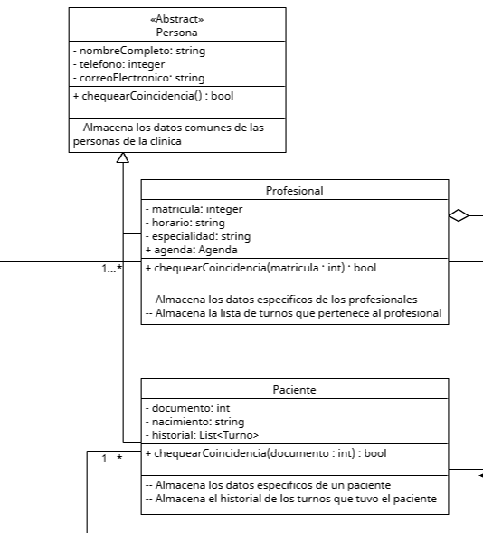

# Herencia

Se trata de el pasaje de caracteristicas relacionadas de una superclase generalizada a una subclase mas especifica. Definiendo atributos y/o comportamientos comunes entre las diferentes implementaciones especificas.
Asi se puede tener un codigo extensible y jerarquico entre varias entidades que compartan caracteristicas.
El principio mas importante que implementa es el principio de Liskov, ya que este justamente se basa en la capacidad de utilizar superclaes generales (Persona), y que siendo substituidas por sus subclases (Paciente, Profesional) no se rompa la funcionalidad

## Ejemplo en el proyecto

  
[link a foto en gdrive](https://drive.google.com/file/d/1h8v2TlwcqnlYO3-wDXDEvEwivBD3l5dM/view?usp=drive_link)

Se puede ver bien este principio en la relacion de las clases paciente y profesional con la clase persona. Al implementar esta clase abstracta estos heredan atributos compartidos que podria tener cualquier Persona y reciben una guia de que metodos deberian tener como minimo


## Ejemplo de codigo

```csharp

// La clase abstracta persona contiene los datos comunes para un paciente y un profesional
// Junto con el metodo (aun abstracto) para chequear si es la persona buscada
abstract class Persona {
    protected string nombreCompleto;
    protected int telefono;
    protected string email;

    protected Persona( /*params*/ ){
        // inicializar a la persona
    }

    abstract public bool ChequearCoincidencia( /*params*/ );
}

// profesional y paciente expanden a la persona con informacion especifica e implementan
// la forma de buscar la coincidencia
class Paciente : Persona {
    private int documento;
    private DateTime nacimiento;
    private List<Turno> historial;

    public Paciente( /*params*/ ) : base( /*params*/ ){
        // inicializa al paciente
    }    

    public override bool ChequearCoincidencia( /*params*/ ){
        // ...
    }
}
class Profesional : Persona {
    public Profesional( /*params*/ ) : base( /*params*/ ){
        // inicializa al profesional
    }

    public override bool ChequearCoincidencia( /*params*/ ){
        // ...
    }
}

```

En este ejemplo, se muestra como el paciente y profesional (subclases) heredan atributos y metodos de la clase abstracta persona, que implementan como su clase base (superclase)