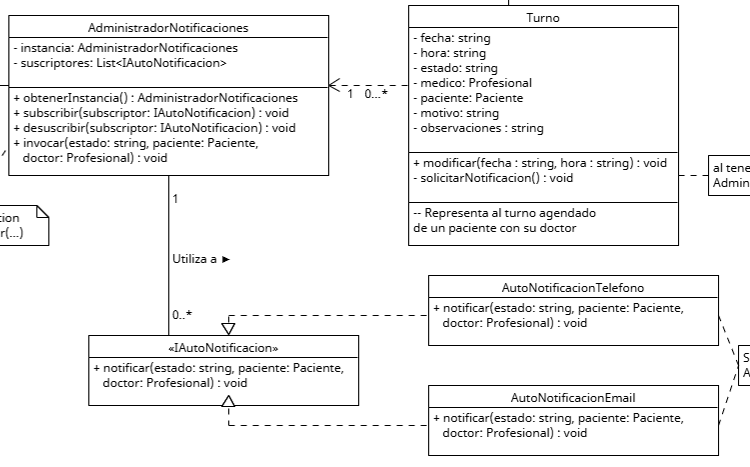

# Polimorfismo

El polimorfismo se trata de permitir que los objetos en una jerarquia de clases, implementen de forma diferente un mismo metodo, asi se permite que un objeto pueda responder de forma diferente a una misma interaccion.
Se relaciona con el principio SOLID de Open/Closed ya que permite agregar funcionalidades extendiendo o definiendo nuevas funcionalidades, sin modificar el codigo de una superclase/interfaz. Por ej. se puede definir una interfaz con un metodo cobrar, y luego subclases que lo implementen para cobrar con dinero, tarjeta, etc.
Tomando el ejemplo anterior tambien se puede relacionar con Dependency Inversion, ya que se puede utilizar el metodo Superclase.cobrar() para permitir utilizar las implementaciones, sin depender directamente de ellas.


## Ejemplo en el proyecto


[link a foto en gdrive](https://drive.google.com/file/d/1ueMiPW_gVNLNHDqSVfNMqtF24SLZ0bOT/view?usp=drive_link)

Para este principio se podria utilizar el ejemplo del notificador automatico, en este caso varias clases mas especificas implementan a la interfaz de IAutoNotificacion segun el metodo de notificacion que usan. Para ser utilizados por la clase AdministradorNotificaciones a la hora de enviar algun aviso


## Ejemplo de codigo

```csharp

interface IAutoNotificacion{
    void Notificar( /*params*/ );
}

// ambas clases implementan el metodo notificar segun sus necesidades
// asi pueden generar la notificacion desde el sistema que representan
class AutoNotificacionTelefono : IAutoNotificacion{
    public void Notificar( /*params*/ ){
        // notificar por telefono
    }
}
class AutoNotificacionEmail : IAutoNotificacion{
    public void Notificar( /*params*/ ){
        // notificar por email
    }
}

class AdministradorNotificaciones {
    // ...

    // el notificador sabe que tiene una lista de objetos con el metodo notificar()
    // sea la implementacion que tengan, esta se define en la clase implementadora
    private List<IAutoNotificacion> suscriptores;

    // ...
}

```

En este ejemplo, Los notificadores especifican el funcionamieno del metodo notificar() en la interfaz de IAutoNotificacion, segun su sistema de aviso. Asi ambos pueden responder de la forma deseada cuando AdministradorNotificaciones avise a los subscriptores de que necesita generar un nuevo aviso 