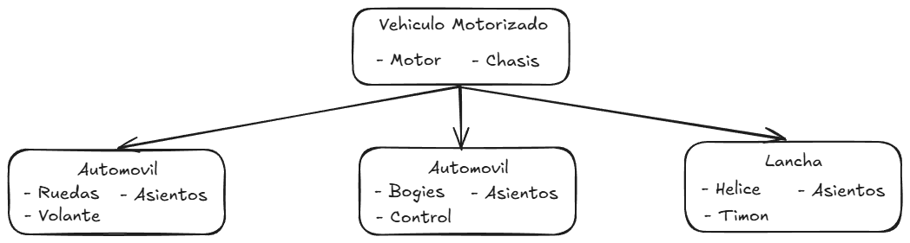

## Anexo - Introducción al Diseño Orientado a Objetos
Desde principio de la década de los noventa hasta la actualidad, la Programación Orientada a Objetos se ha establecido como el paradigma más extendido entre la comunidad de programadores
La Programación Orientada a Objetos supone un cambio en la concepción
del mundo de desarrollo de software, introduciendo una mayor abstracción que permite mejorar las características del código final. Las aportaciones de este paradigma se pueden resumir en lo siguientes beneficios:

- <strong>Abstraccion:</strong> Consta de separar al objeto de el contexto en el que normalmente se lo relaciona, para pensar que es lo que lo diferencia de los demas objetos y llevarlo asi a una expresion mas simplificada que represente solo las caracteristicas que lo definen

- <strong>Herencia:</strong> permite la reutilización del código heredado. Se pueden usar las clases en distintas partes del programa y en diferentes proyectos de manera que no es necesario escribirlas de nuevo. Además, al aplicar un cambio en la clase, todas las subclases lo adoptarán automáticamente. Tambien aporta mayor modificabilidad permitiendo añadir, modificar o eliminar nuevos objetos o funciones fácilmente.

- <strong>Encapsulamiento:</strong> Facilidad para detectar errores en el código. Gracias a la encapsulación, es más fácil abstraer un problema y saber dónde buscar el error. Tambien aporta modularidad, un equipo puede trabajar en múltiples objetos a la vez mientras se minimizan las posibilidades de codigo duplicado. También permite dividir los problemas en partes más pequeñas.

- <strong>Polimorfismo:</strong> Aporta flexibilidad. Gracias al polimorfismo se permite a una funcion adaptarse a cualquier clase donde se encuentre. De esta forma se ahorra tiempo y se gana en versatilidad.

---

## Requisitos funcionales
- Registrar clientes: El sistema debera ser capaz de mantener objetos cliente que representen a los clientes de la clinica, manteniendo sus datos personales nombre completo, número de documento, fecha de nacimiento, información de contacto (teléfono, correo electrónico) y un historial de turnos asociados.
- Registrar profesional de la salud: se debe registrar su
nombre, matrícula profesional, especialidad, horario de atención y datos de contacto.
- En la agenda de turnos se registra la fecha y hora del turno, el estado del turno
(confirmado, cancelado, pendiente), el médico asignado y el paciente correspondiente.
También se debe guardar un motivo del turno y observaciones si las hubiera.
- Credenciales
- Notificaciones

## Casos de uso
- ####  <u> nuevo cliente </u>
    - <strong> Actor(es) involucrado(s) </strong>
    - <strong>Descripcion: </strong> Durante la gestion de los turnos, existe la posibilidad de que el cliente que solicita un turno no se haya atendido anteriormente, en este caso es necesario generar un nuevo perfil con los datos del nuevo cliente
    - <strong> Flujo principal de eventos </strong>
    - <strong> Precondiciones: </strong> Solicitud de nuevo cliente, no existe dentro del sistema
    - <strong> Postcondiciones: </strong> Nuevo objeto cliente dentro del sistema, contiene los datos pertinentes
- ####  <u> nuevo profesional de la salud </u>
    - <strong> Actor(es) involucrado(s) </strong>
    - <strong> Descripcion: </strong> Es posible que la clinica tenga la necesidad de contratar nuevos profesionales para ofrecer nuevos servicios que se encuentren en demanda, en este caso seria necesario generar un nuevo perfil con los datos del nuevo profesional
    - <strong> Flujo principal de eventos: </strong>
    - <strong>Precondiciones: </strong> Nueva contratacion de profesional de la salud, no existe dentro del sistema
    - <strong>Postcondiciones: </strong> Nuevo objeto conteniendo los datos pertinentes del nuevo profesional de la salud
- #### <u> nuevo turno </u>
    - <strong> Actor(es) involucrado(s) </strong>
    - <strong> Descripcion: </strong> Seria la funcion principal y mas importante de este gestor, al recibir el pedido de atencion de un cliente, es necesario generar un nuevo turno a su nombre en la agenda de turnos 
    - <strong> Flujo principal de eventos </strong>
    - <strong> Precondiciones </strong>
    - <strong> Postcondiciones </strong>
- #### <u> consulta de turno </u>
    - <strong> Actor(es) involucrado(s) </strong>
    - <strong> Descripcion: </strong> En caso de que sea necesario recordarle los datos del turno al cliente, se haria necesario tener la capacidad de consultar la informacion de la agenda de turnos
    - <strong> Flujo principal de eventos </strong>
    - <strong> Precondiciones </strong>
    - <strong> Postcondiciones </strong>
- #### <u> notificacion </u>
    - <strong> Actor(es) involucrado(s) </strong>
    - <strong> Descripcion: </strong> En caso de que suceda algun evento relacionado al turno del cliente, seria necesario notificar a quien sea pertinente de que se produjo un evento, que tipo de evento es y  sobre cual turno
    - <strong> Flujo principal de eventos </strong>
    - <strong> Precondiciones </strong>
    - <strong> Postcondiciones </strong>
- #### <u> acceso al sistema </u>
    - <strong> Actor(es) involucrado(s) </strong>
    - <strong> Descripcion: </strong> Para mantener la seguridad de los datos dentro del sistema, es necesario requerir el chequeo de aprobacion al momento de ingresar al sistema
    - <strong> Flujo principal de eventos </strong>
    - <strong> Precondiciones </strong>
    - <strong> Postcondiciones </strong>

## Boceto inicial del diseño de clases