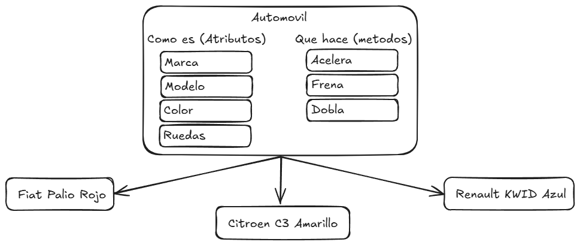
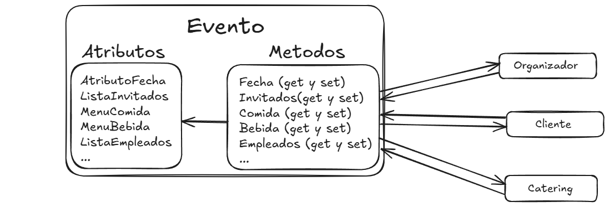
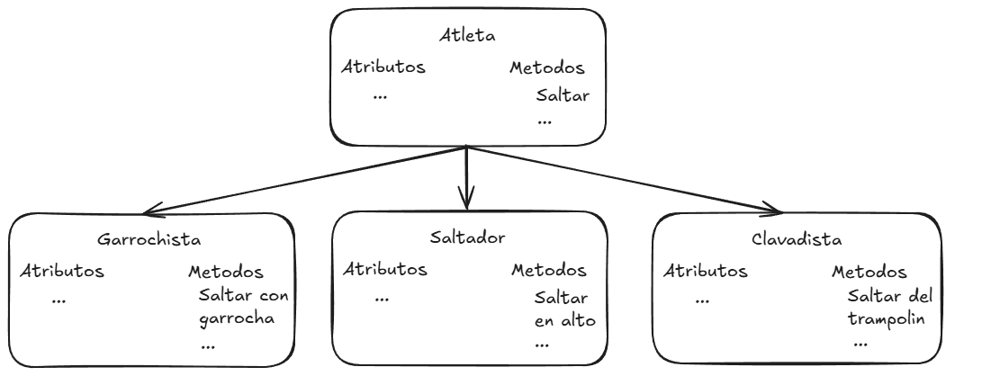
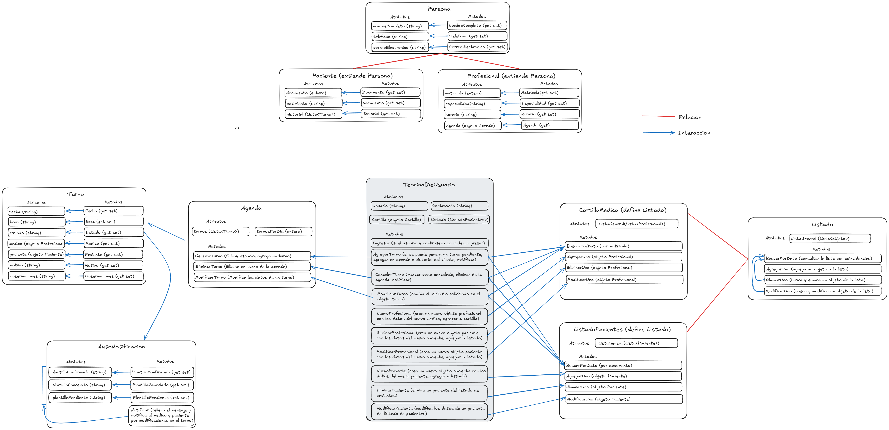

## Anexo - Introducción al diseño orientado a objetos
Desde principio de la década de los noventa hasta la actualidad, la Programación Orientada a Objetos se ha establecido como el paradigma más extendido entre la comunidad de programadores
Este modelo de programación se organiza alrededor de datos u objetos, en vez de usar funciones y lógica. Se enfoca en los objetos que se manipulan, en lugar de en la lógica necesaria para esa manipulación. Por esto, la principal característica de este tipo de programación es que soporta objetos
La Programación Orientada a Objetos supone un cambio en la concepción del mundo de desarrollo de software, introduciendo una mayor abstracción que permite mejorar las características del código final. Las aportaciones de este paradigma se pueden resumir en lo siguientes beneficios:

- <strong>Abstraccion:</strong> Consta de separar al objeto de el contexto en el que normalmente se lo relaciona, para pensar que es lo que lo diferencia de los demas objetos y llevarlo asi a una expresion mas simplificada que represente solo las caracteristicas que lo definen. [Link al grafico](# "Title")

- <strong>Herencia:</strong>  permite la reutilización del código heredado. Se pueden usar las clases en distintas partes del programa y en diferentes proyectos de manera que no es necesario escribirlas de nuevo. Además, al aplicar un cambio en la clase, todas las subclases lo adoptarán automáticamente. Tambien aporta mayor modificabilidad permitiendo añadir, modificar o eliminar nuevos objetos o funciones fácilmente. [Link al grafico](https://excalidraw.com/#json=FxrRERw9nSOBUSBMmflaR,FeeHuNq_30etTGuRFt6SLg "Title")

- <strong>Encapsulamiento:</strong> Facilidad para detectar errores en el código. Gracias a la encapsulación, es más fácil abstraer un problema y saber dónde buscar el error. Tambien aporta modularidad, un equipo puede trabajar en múltiples objetos a la vez mientras se minimizan las posibilidades de codigo duplicado. También permite dividir los problemas en partes más pequeñas.  [Link al grafico](https://excalidraw.com/#json=dAxXb9ybYKSou77apYc2L,h8K_mbSXSk36QsciyWxC6Q "Title")

- <strong>Polimorfismo:</strong> Aporta flexibilidad. Gracias al polimorfismo se permite a una funcion adaptarse a cualquier clase donde se encuentre. De esta forma se ahorra tiempo y se gana en versatilidad. [Link al grafico](https://excalidraw.com/#json=UM582BP5g4EHHgvow3Zvb,8k1ihIrYFDQ5PhxJcq6Jdw "Title")

---

## Requisitos funcionales
- Registrar clientes: El sistema debera ser capaz de mantener objetos cliente que representen a los clientes de la clinica, manteniendo sus datos personales como nombre completo, número de documento, fecha de nacimiento, información de contacto (teléfono, correo electrónico) y un historial de turnos asociados.
- Registrar profesional de la salud: Se debe registrar los datos pertinente en caso de nuevas contrataciones para la clinica, el nombre, matrícula, especialidad, horario de atención y datos de contacto de los profesionales de la salud.
- Agenda de turnos: En la agenda de turnos se registra la fecha y hora del turno, el estado del turno (confirmado, cancelado, pendiente), el médico asignado y el paciente correspondiente. También se debe guardar un motivo del turno y observaciones si las hubiera.
- Credenciales: El sistema debe disponer de credenciales para mantener controlado el acceso al sistema, de tal forma que se proteja la integridad de los turnos y los datos de los clientes, ademas de su privacidad
- Notificaciones: El sistema debe ser capaz de notificar a los interesados de los cambios sucedidos en relacion a los turnos, para poder mantenerlos en conocimiento de posibles sucesos que puedan llegar a afectar su atencion medica (por ejemplo, un paciente no tiene tiempo, el doctor se enfermo y no puede presentarse)

---

## Casos de uso
- ###  <u> Nuevo paciente </u>
    - <strong> Actor(es) involucrado(s):</strong> Terminal de usuario, pacientes
    - <strong>Descripcion: </strong> Durante la gestion de los turnos, existe la posibilidad de que el cliente que solicita un turno no se haya atendido anteriormente, en este caso es necesario generar un nuevo perfil con los datos del nuevo cliente
    - <strong> Flujo principal de eventos: </strong> El nuevo paciente pide un turno, se ingresan sus datos en el sistema, se valida que los datos se ingresaron correctamente, se busca en el listado de pacientes, no existe, se genera un nuevo objeto paciente con los datos, se ingresa este nuevo objeto en el listado de pacientes, ahora es posible responder a la solicitud de turno
    - <strong> Precondiciones: </strong> Solicitud de nuevo cliente, no existe dentro del sistema
    - <strong> Postcondiciones: </strong> Nuevo objeto cliente dentro del sistema, contiene los datos pertinentes
- ###  <u> Nuevo profesional de la salud </u>
    - <strong> Actor(es) involucrado(s): </strong> Terminal de usuario, profesional de la salud
    - <strong> Descripcion: </strong> Es posible que la clinica tenga la necesidad de contratar nuevos profesionales para ofrecer nuevos servicios que se encuentren en demanda, en este caso seria necesario generar un nuevo perfil con los datos del nuevo profesional
    - <strong> Flujo principal de eventos: </strong> Se genera una nueva contratacion, por lo tanto el profesional no existe en el sistema, se ingresan sus datos en el sistema, se valida que los datos se ingresaron de forma correcte, se genera un nuevo objeto con los datos del nuevo doctor, se le asigna una nueva agenda vacia, se guarda en la cartilla medica, ahora esta habilitado para recibir turnos
    - <strong>Precondiciones: </strong> Nueva contratacion de profesional de la salud, no existe dentro del sistema
    - <strong>Postcondiciones: </strong> Nuevo objeto conteniendo los datos pertinentes del nuevo profesional de la salud
- ### <u> Nuevo turno </u>
    - <strong> Actor(es) involucrado(s): </strong> Paciente, Terminal de usuario, Profesional de la salud
    - <strong> Descripcion: </strong> Seria la funcion principal y mas importante de este gestor, al recibir el pedido de atencion de un cliente, es necesario generar un nuevo turno a su nombre en la agenda de turnos 
    - <strong> Flujo principal de eventos: </strong> Un paciente solicita un turno, se busca al paciente dentro del sistema, si existe se continua sino se pide que se ingrese antes de continuar, se genera un objeto turno con los datos de la consulta, se busca la agenda del doctor/especialidad solicitado(a), Se ingresa el turno en la agenda, se notifica de este nuevo turno
    - <strong> Precondiciones </strong> Un cliente necesita un turno nuevo, sabe la especialidad/prestador que necesita
    - <strong> Postcondiciones </strong> El cliente agendo su nuevo turno
- ### <u> consulta de turno </u>
    - <strong> Actor(es) involucrado(s): </strong> Paciente, Terminal de usuario
    - <strong> Descripcion: </strong> En caso de que sea necesario recordarle los datos del turno al cliente, se haria necesario tener la capacidad de consultar la informacion de la agenda de turnos
    - <strong> Flujo principal de eventos: </strong> Un cliente no recuerda sus turnos, se ingresa al historial de turnos del cliente, se le informa de los turnos que necesite saber, el paciente ahora tiene la informacion buscada
    - <strong> Precondiciones </strong> El cliente necesita la informacion de su turno, lo pidio previamente
    - <strong> Postcondiciones </strong> El cliente obtuvo la informacion necesaria
- ### <u> notificacion </u>
    - <strong> Actor(es) involucrado(s): </strong> Paciente, Terminal de usuario, Profesional de la salud
    - <strong> Descripcion: </strong> En caso de que suceda algun evento relacionado al turno del cliente, seria necesario notificar a quien sea pertinente de que se produjo un evento, que tipo de evento es y  sobre cual turno
    - <strong> Flujo principal de eventos: </strong> El cliente no puede acudir a la consulta, solicita la cancelacion de su turno, se busca en la agenda del doctor, se cambia el estado del turno a "cancelado", el sistema ejecuta una notificacion automatica al suceder un cambio
    - <strong> Precondiciones: </strong> Existe un turno, el paciente desea cancelarlo
    - <strong> Postcondiciones: </strong> El paciente ya no tiene el turno previamente agendado 
- ### <u> acceso al sistema </u>
    - <strong> Actor(es) involucrado(s): </strong> Usuario, Terminal de usuario
    - <strong> Descripcion: </strong> Para mantener la seguridad de los datos dentro del sistema, es necesario requerir el chequeo de aprobacion al momento de ingresar al sistema
    - <strong> Flujo principal de eventos: </strong> El usuario desea ingresar al sistema, ingresa el usuario, ingresa la contraseña, se chequea si ambos datos son correctos, si son correcots el usuario ingresa al sistema sino se avisa que no los datos ingresados son incorrectos
    - <strong> Precondiciones: </strong> Un usuario desea ingresar al sistema, tiene acceso a este
    - <strong> Postcondiciones </strong> El usuario accede al sistema con exito

---

##  [Boceto inicial del diseño de clases](https://excalidraw.com/#json=KZ2K05D3fDmmzUnPLjUr7,kv-aiHTS16bJzXqlilG6xg "Title")

