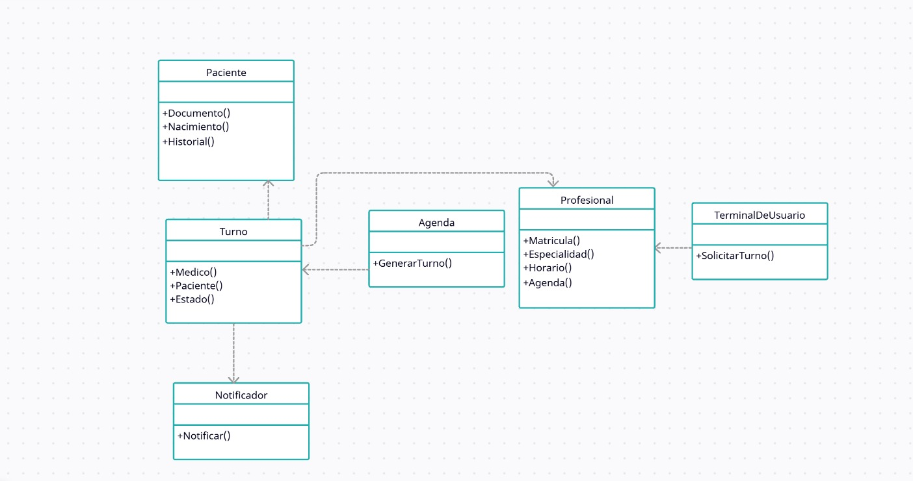

# Principio de Segregación de Interfaces (ISP)

Este principio describe que ninguna clase deberia depender de metodos a los que no utiliza, asi cuando creamos interfaces para definir los comportamientos necesarios, es de suma importancia que las clases que van a implementar estas interfaces utilizen e implementen todos los metodos que tiene.
 
Teniendo en cuanta este principio, se crearon interfaces más simples y especificas, que puedan concentrarse en manejar los turnos sin tener que preocuparse por enviar notificaciones.

## Motivacion

El sistema de gestion de turnos sufrio de estos problemas al implementar grandes componentes que contenian funciones a las que no podian darle utilidad, o no deberian de hacerlo. Asi, por ejemplo, una agenda de turnos se veia forzada a implementar funciones mas alla de su funcionalidad deseada.

Al separar las interfaces de las diferentes clases, se pudo cumplir con este principio al aumentar la especificidad del comportamiento de cada clase, asi se implementa una interface que se dedica a ejecutar las notificaciones, gestionar el acceso a los turnos, etc.

Un ejemplo del mundo real seria que si un administrativo necesita rellenar una planilla de obra social, no es necesaria una planilla de varias paginas con todos los requisitos de todas las obras sociales, que puede llevar a problemas y confusiones como rellenar el area equivocada. Al dividirla en varias planillas especificas para cada obra social, se ahorran errores y confusiones.

## [Estructura de clases](https://drive.google.com/file/d/1S4uMj5upb7yOx5_3-BMUypNmqjVDAq_9/view?usp=drive_link)

