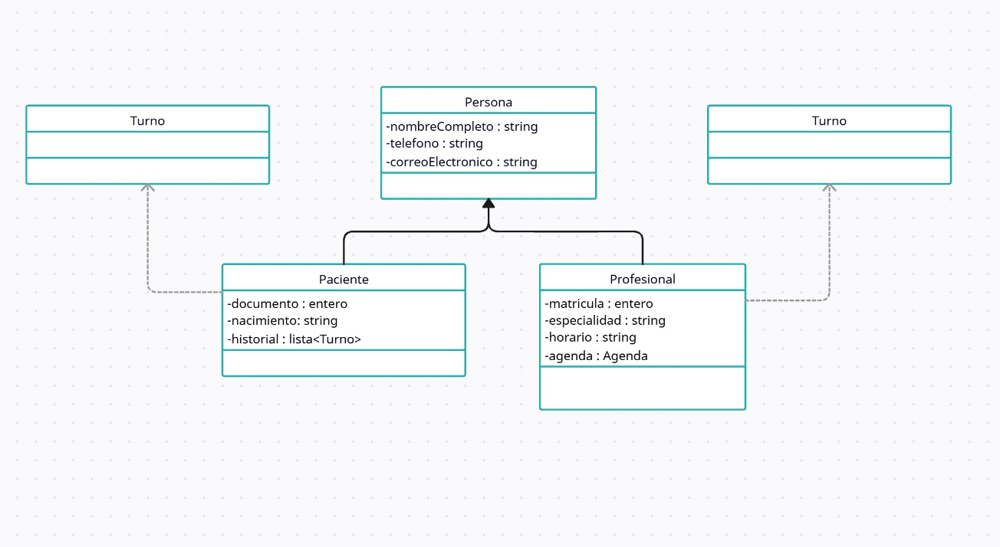

# Principio de Sustitución de Liskov (LSP)

El principio de sustitucion de Liskov propone que los subtipos que provienen de un tipo, deben ser capaces de remplazar a este tipo sin generar problemas en el sistema. Es decir que, si tenemos un tipo X que es un subtipo de otro tipo Y, entonces los objetos de tipo Y en un sistema pueden reemplazarse con objetos de tipo X sin alterar ninguna de las propiedades del sistema.

Por ejemplo todos las personas pueden cambiar sus datos de contacto, sin importar que rol tengan en el sistema. Pero solo los doctores pueden aceptar turnos en su agenda.

## Motivacion

Este problema de sustitucion se presento en el sistema de gestion al administar los datos de los pacientes y medicos, al ser almacenados en el mismo elemento se almacenaban los mismos datos, el sistema era susceptible a cometer errores permitirle a un paciente tener una agenda de turnos la cual puede aceptar turnos de pacientes.

Es asi que se decidio seguir este principio y separar los comportamientos generales en un tipo persona del cual desprender los subtipos como paciente y profesional.
Asi se pudo suponer los datos de un actor persona, sin exponerse a confundir si es un cliente o un profesional.

Un ejemplo de la realidad puede ser que si la clinica permitiera el acceso a todo el personal de la clinica a las areas internas sin discriminar, se podrian generar problemas de esterilizacion por ejemplo. Asi, si se diferenciaran las areas mas importantes, se podria asegurar que todo el personal tenga acceso al area de descanso por ejemplo, pero no sucederia que el personal administrativo ingrese a una sala de operaciones.

## [Estructura de clases](https://drive.google.com/file/d/1fVE2gO9VEmsJTAQ9CVzp1i4wS1N94tGV/view?usp=drive_link)

