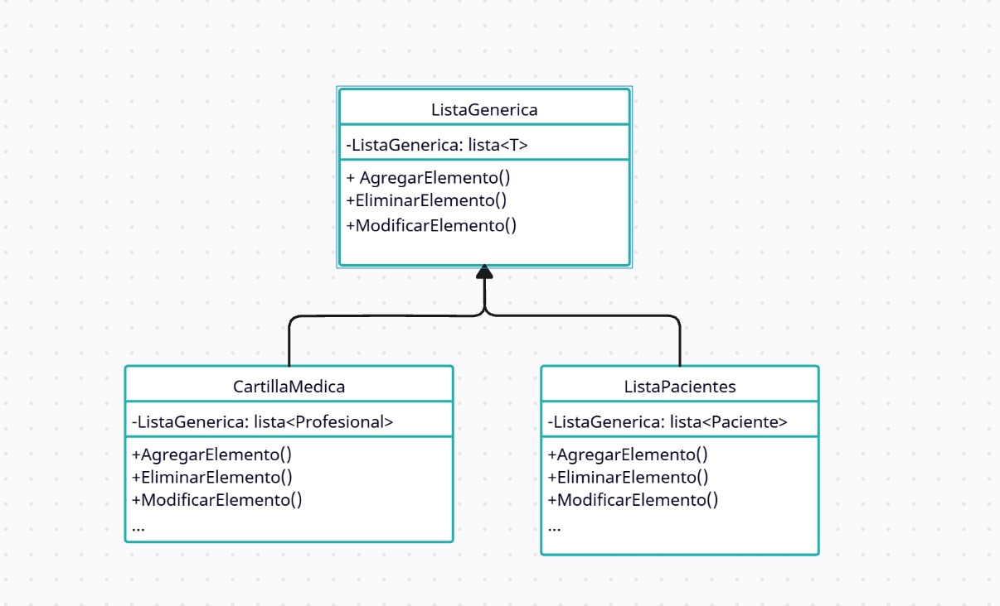

# Principio de Abierto/Cerrado (OCP)

Este principio de SOLID describe que Las entidades de software deben estar abiertas para su extensión, pero cerradas para su modificación. 
Asi se propone que las clases puedan extender sus funcionalidades, pero evitando cambiar componentes ya existentes de la clase. Esto se debe a que al generar una modificacion en el codigo ya existente de una clase, se puede llegar a afectar elementos externos que dependan de la clase modificada.

Es asi que siguiendo este principio y limitando modificaciones a lo extrictamente necesario, se puede evitar estos problemas de dependencia.

## Motivacion

En nuestro sistema de gestion, una parte muy deseada de su funcionamiento es el poder almacenar la informacion de los pacientes y profesionales para facilitar la comunicacion y mejorar la organizacion, facilitando asi el trabajo de los empleados administrativos.
El problema es que al implementar estos sistemas, se generaban problemas al almacenar los diferentes actores y sus diferentes necesidades, a la vez que al querer agregar la posibilidad de almacenar nuevos actores, por ejemplo: Al empleado administrativo, se haria necesario modificar tambien a los actores ya existentes. Causando fragilidad y complejidad innecesaria

Es asi que al implementar este principio, a travez de una clase generica de almacenamiento que pueda ser utilizada por varios actores, a la misma vez que puede ser extendido de ser necesario sin modificar los procesos actuales, se evitaron estos problemas de diseño y se consiguio una mayor flexibilidad.

Un ejemplo del mundo real puede ser si se recibiera una nueva regulacion nacional, que diga que las clinicas tambien deben aplicar el sistema de triage, seria problematico tener que rediseñar sistema de turnos para cumplir con esta nueva regulacion por los problemas de compatibilidad que generaria. en vez de esto, se puede extender la funcionalidad de la agenda para que al agendar nuevos turnos, pueda hacerlo con un orden que tenga en cuenta la complejidad asignada por el triage

## [Estructura de clases](https://drive.google.com/file/d/1jhaZail_2bhfJRw1NmI3P6acRKbnH8Qr/view?usp=drive_link)

