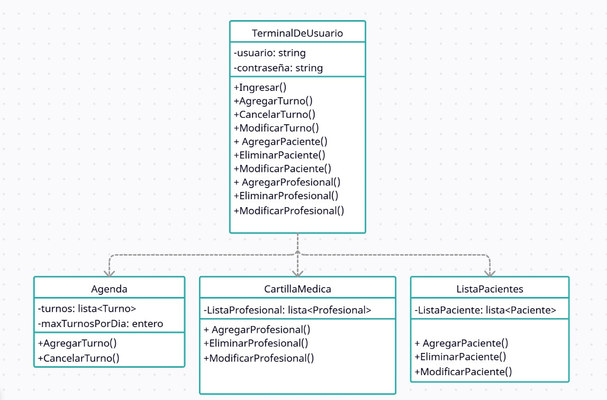

# Principio de Responsabilidad Única (SRP)

Este principio indica que una clase debería ser responsable de una única funcionalidad y solo debería tener una única razón para cambiar.
Esta responsabilidad debe estar encapsulada en su totalidad por la clase.

Ignorar este principio puede tener consecuencias como dificultar la depuración de errores, ya que varios errores apuntan al mismo sitio, las funcionalidades estárian más acopladas y las modificaciones a futuro serian mas complejas.

## Motivacion
El sistema enfrenta la dificultad de que se acumulara gran cantidad de su funcionalidad en una sola clase principal que funcionara como una terminal, generando asi una gran carga de trabajo a la hora de modificar alguna funcion del sistema o simplemente intentar entender el codigo.

Al dividir estas tareas segun sus responsabilidades como aconceja el principio, Se pudo separar la logica de las diferentes funcionalidades en nuevas clases representativas como una lista que guarde a los clientes, un notificador que notifique, una agenda que guarde los turnos, etc. 

Asi se logro Mantener un menor acoplamiento de las diferentes funciones a la misma vez que se facilita las modificaciones y resolucion de errores, por ejemplo: Tengo un error al agendar un turno, el culpable seria la agenda de turnos.

Un ejemplo aplicado al mundo real de este principio seria si un medico de la clinica debiera mantener informados a los pacientes y agendar sus turnos a la misma vez que tiene que diagnosticar.
Al tener alguien que cumpla el papel de secretario, puede dedicarse a diagnosticar solamente, que le permitiria mas tiempo a los diagnosticos o informarse de nuevas enfermedades y en caso de dudas o confusiones administrativas, puede simplemente preguntarle cual es el problema al secretario.

## [Estructura de clases](https://drive.google.com/file/d/1l3Y4eeIuaVU_TIeEjKYHLlngR5UDP9sJ/view?usp=drive_link)

